# Piscine Mobile 📱

A comprehensive mobile application development course covering React Native fundamentals through advanced features like authentication, data management, and real-time updates.

## Overview

Piscine Mobile is a progressive learning project that covers the entire lifecycle of mobile application development using React Native and Expo. Starting from basic fundamentals, the course progresses through API integration, UI design, authentication, and advanced data management patterns.

This project demonstrates modern mobile development practices including:
- Component-based architecture
- API integration and data fetching
- User authentication and authorization
- Real-time data synchronization
- Advanced UI/UX design patterns
- State management and local storage

## Project Structure

```
Piscine-Mobile/
├── 0-Basic-of-the-mobile-application/
│   └── mobileModule00/          # Calculator app & React Native fundamentals
├── 1-Structure-logic/
│   └── mobileModule01/          # App structure and logic patterns
├── 2-API-data/
│   └── mobileModule02/          # API integration and data fetching
├── 3-Design/
│   └── mobileModule03/          # Advanced UI/UX design (Weather app)
├── 4-Auth-dataBase/
│   └── mobileModule04/          # Authentication & database integration
├── 5-Manage-data-display/
│   └── mobileModule05/          # Data management and display (Agenda app)
└── .img/                        # Screenshots and media assets
```

## Modules

### Module 0: Basic Mobile Application
**Folder:** `0-Basic-of-the-mobile-application/mobileModule00`

Learn the fundamentals of React Native development:
- Setting up Expo projects
- Basic components and layouts
- Navigation basics
- Building your first calculator app

### Module 1: Structure & Logic
**Folder:** `1-Structure-logic/mobileModule01`

Master application structure and logic patterns:
- Component organization
- State management basics
- Navigation flow
- Business logic separation

### Module 2: API & Data
**Folder:** `2-API-data/mobileModule02`

Integrate external APIs and manage data:
- HTTP requests and REST API integration
- Data fetching patterns
- Error handling
- Loading states

### Module 3: Design 🎨
**Folder:** `3-Design/mobileModule03`

Build beautiful user interfaces with advanced design patterns:
- Custom components
- Animations and transitions
- Material Design principles
- Weather application example

#### Module 3 Screenshots:

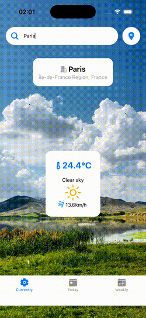
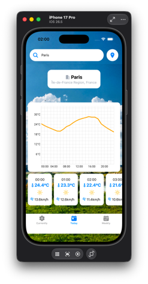
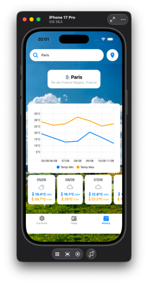
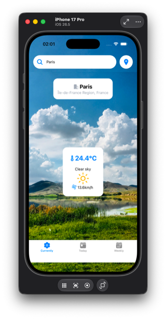
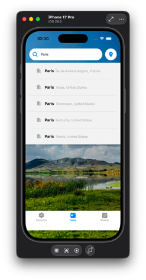
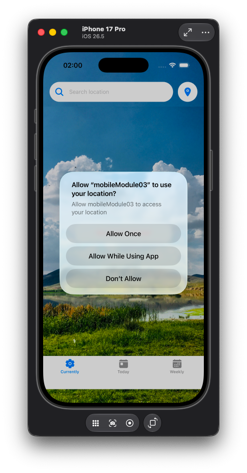

### Module 4: Authentication & Database
**Folder:** `4-Auth-dataBase/mobileModule04`

Implement user authentication and data persistence:
- User registration and login
- JWT authentication
- Database integration with Supabase
- Secure data storage
- Session management

### Module 5: Data Management & Display 📊
**Folder:** `5-Manage-data-display/mobileModule05`

Master advanced data management and display techniques:
- Complex data structures
- Real-time data synchronization
- Calendar integration
- Agenda application example
- WebSocket integration

#### Module 5 Screenshots:

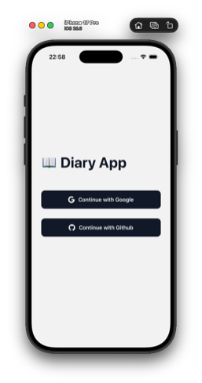
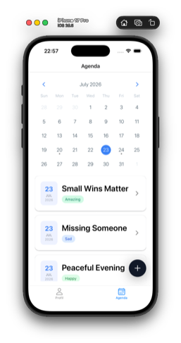
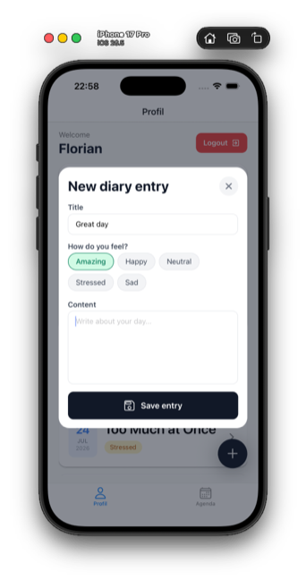
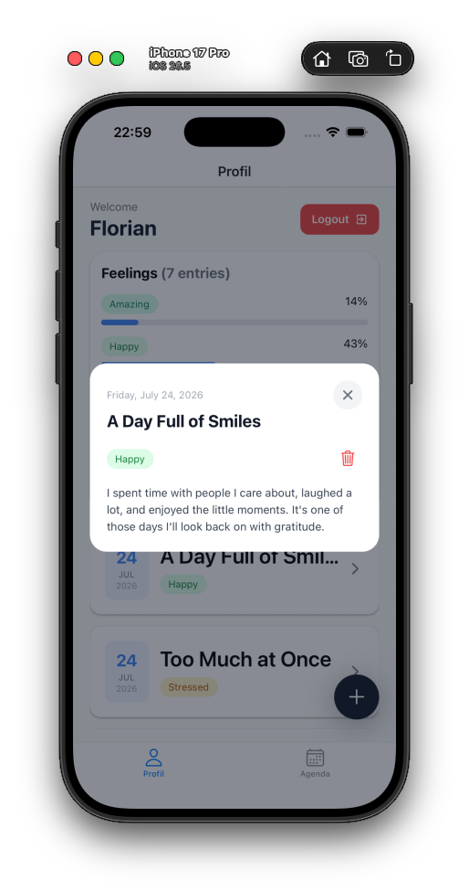
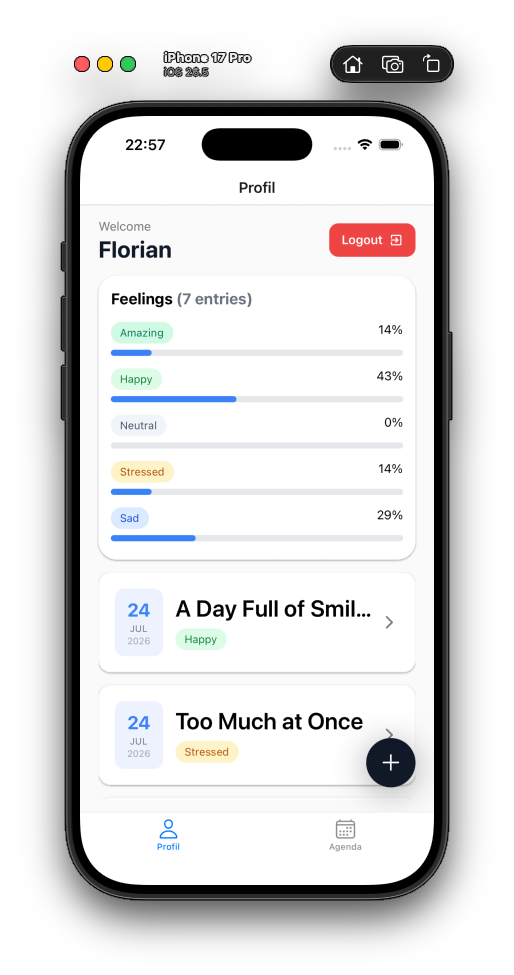

## Prerequisites

Before you begin, ensure you have the following installed:

- **Node.js** (v16 or higher) - [Download](https://nodejs.org/)
- **npm** (v7 or higher) - Comes with Node.js
- **Expo CLI** - Install with `npm install -g expo-cli`
- **Git** - [Download](https://git-scm.com/)

For iOS development:
- **Xcode** and iOS simulator

For Android development:
- **Android Studio** and Android SDK

Or use the Expo Go app:
- **Expo Go** - Available on [App Store](https://apps.apple.com/app/expo-go/id982107779) and [Google Play](https://play.google.com/store/apps/details?id=host.exp.exponent)

## Installation

1. **Clone the repository:**
   ```bash
   git clone git@github.com:fguirama/Piscine-Mobile.git
   cd Piscine-Mobile
   ```

2. **Navigate to a module:**
   ```bash
   cd 3-Design/mobileModule03
   # or
   cd 5-Manage-data-display/mobileModule05
   ```

3. **Install dependencies:**
   ```bash
   npm install
   ```

## Getting Started

### Run on Expo Go (Recommended for beginners)

1. **Start the development server:**
   ```bash
   npm start
   ```

2. **Scan the QR code** with:
   - Expo Go app (iOS/Android)
   - Camera app (iOS 11+)
   - Control Center (iOS 17+)

### Run on iOS Simulator

```bash
npm run ios
```

### Run on Android Emulator

```bash
npm run android
```

### Run on Web

```bash
npm run web
```

## 📚 Resources

- [React Native Documentation](https://reactnative.dev)
- [Expo Documentation](https://docs.expo.dev)
- [React Navigation Docs](https://reactnavigation.org)
- [TypeScript Handbook](https://www.typescriptlang.org/docs)
- [NativeWind Docs](https://www.nativewind.dev)
- [Supabase Docs](https://supabase.com/docs)
